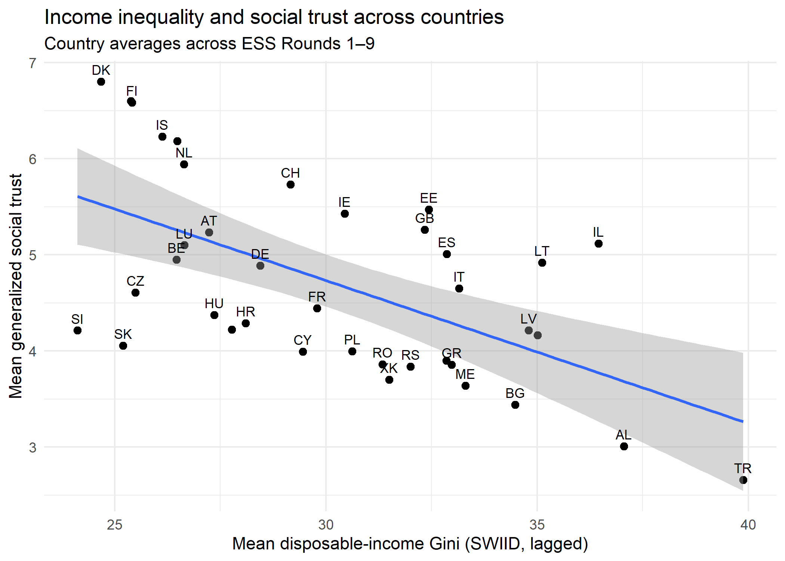
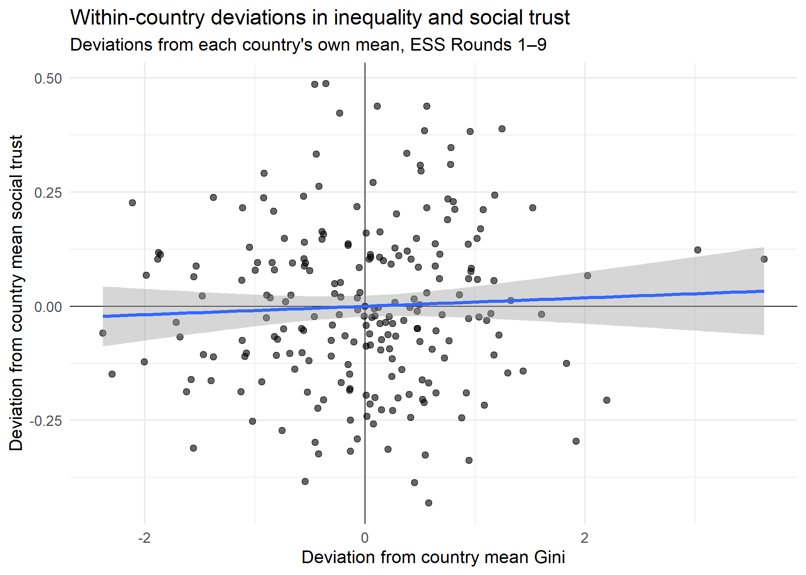

# Economic Inequality, Political Discourse, and Social Cohesion in Europe

## Project overview

This repository contains the reproducible computational work for a research project examining the relationship between economic inequality and social cohesion in Europe.

The core research question is:

> Does economic inequality predict lower social trust and greater perceived social conflict in Europe, and are these relationships stronger in countries or periods characterised by more divisive political discourse?

The intended output is a journal article.

## Current status

The project is currently in the empirical analysis stage.

The first analysis focuses on the relationship between income inequality and generalised social trust using repeated cross-sectional data from the European Social Survey (ESS), Rounds 1–9.

Data preparation and initial descriptive analysis are complete. The next stage estimates multilevel within-between models that distinguish:

- persistent differences in inequality between countries; and
- changes in inequality within countries over time.

Political-discourse moderation and perceived social conflict will be developed in subsequent stages.

## Current empirical design

The primary outcome is the ESS measure of generalised social trust (`ppltrst`).

Income inequality is measured using the disposable-income Gini coefficient. The current analytical strategy uses:

- **SWIID** as the primary inequality series because of its complete temporal and geographical coverage of the ESS analytical sample;
- **OECD Income Distribution Database** measures as a robustness comparison.

The primary inequality exposure is lagged by one year. Because ESS fieldwork frequently spans two calendar years, annual inequality values are aggregated to the country-round level using the proportion of respondents interviewed in each calendar year.

The primary empirical estimand is the within-country relationship between changes in inequality and social trust. Between-country differences are estimated separately.

Further details are documented in [`02_research-design/research_design.qmd`](02_research-design/research_design.qmd).

## Preliminary descriptives

Initial descriptive results show a strong negative cross-national relationship between average inequality and average social trust.



The corresponding within-country relationship is much weaker at the descriptive level, motivating the use of models that separate within- and between-country variation and account for common period effects.



These figures are exploratory and should not be interpreted as causal estimates.

## Repository structure

```text
01_lit/
    evidence_tables/        Literature coding and evidence synthesis

02_research-design/
    research_design.qmd     Current empirical design
    research_qns/           Research questions and project scope

03_data/
    README.md               Data sources, access, and handling documentation

04_code/
    01_import-clean/        Data import, coverage checks, cleaning, and merging
    02_descriptives/        Descriptive analysis and figures
    03_models/              Statistical models [in development]

docs/
    figures/                Selected public-facing figures