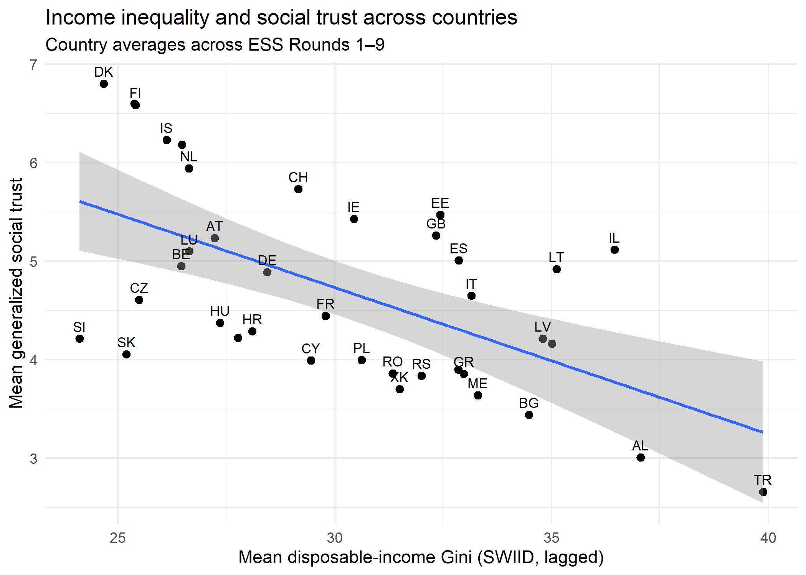
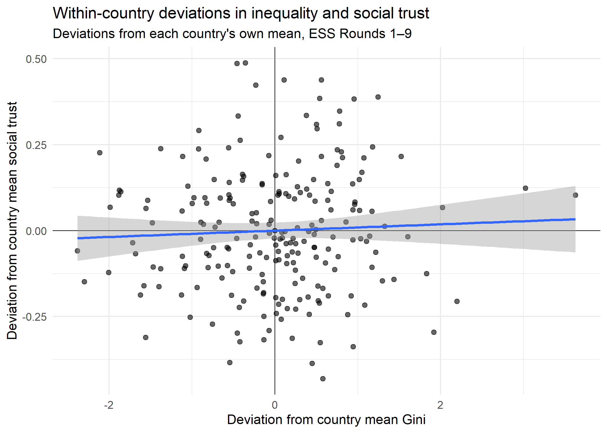

# Economic Inequality, Political Discourse, and Generalised Trust in Europe

## Project overview

This repository contains the computational work and methodological documentation for a research project examining economic inequality, political discourse and generalised trust in Europe. Social cohesion provides the broader motivation; the current analysis focuses specifically on generalised trust.

The core research question is:

> To what extent is economic inequality associated with lower generalised trust across European countries and over time?

The moderation question is:

> Is the within-country inequality–trust association more negative in country-periods characterised by more divisive political discourse?

The current empirical analysis operationalises one dimension of political discourse: political parties’ use of group-directed hate speech.

## Current status

The first moderation models and a series of sensitivity checks have been completed.

The analysis uses repeated cross-sectional European Social Survey (ESS) data, comparing Rounds 1–9 with an extended Rounds 1–11 sample. Multilevel within–between models distinguish persistent differences between countries from changes within countries.

Completed work includes:

- construction of country-round inequality, macroeconomic and party hate-speech exposures;
- estimation of baseline and party hate-speech moderation models;
- country-influence analysis;
- contextual-exclusion and sample-reproduction checks;
- comparison of lagged and contemporaneous hate speech;
- an in-person interview sensitivity analysis;
- examination of available within-country Gini variation; and
- explanatory methods notebooks.

The current models estimate a weak conditional within-country inequality–trust association and provide no clear evidence of the proposed moderation. A positive within-country association between party hate speech and trust persists across the examined exposure timings and interview-mode restriction, with some sensitivity to country composition.

These findings are provisional and observational. Survey weighting and propagation of exposure measurement uncertainty remain outstanding.

## Current empirical design

The primary outcome is ESS generalised trust (`ppltrst`), measured on a 0–10 scale.

Income inequality is measured using the disposable-income Gini coefficient from SWIID. OECD Income Distribution Database measures are retained for a planned robustness comparison. SWIID provides broader coverage in the initial source assessment, but some country-rounds are excluded from the fitted samples because required contextual values are unavailable.

Party hate speech is measured using the reversed interval-scale V-Dem indicator `v2smpolhate`, so that higher values indicate more hate speech. This is a specific measure of party rhetoric rather than a comprehensive measure of divisive discourse.

The main inequality and hate-speech exposures are lagged by one year. Because ESS fieldwork can span multiple calendar years, annual values are aggregated to country-rounds using respondent shares across known interview years.

The models include:

- separate within-country and between-country components of inequality and hate speech;
- primary moderation involving within-country inequality and within-country hate speech, with the interaction product itself decomposed into within-country and between-country components;
- secondary moderation involving within-country inequality and country-average hate speech;
- individual controls, lagged GDP and unemployment, and ESS-round fixed effects; and
- country and country-round random intercepts.

Models within each analytical period use a common complete-case sample. Current estimation is unweighted and uses contextual point estimates.

Further details, findings and outstanding decisions are documented in the [research design](02_research-design/research_design.md). Its editable source is [`research_design.qmd`](02_research-design/research_design.qmd).

## Preliminary descriptives

The initial exploratory figures illustrate the distinction between cross-national differences and within-country change. They precede the current adjusted moderation models.





These figures are descriptive and should not be interpreted as causal estimates or substitutes for the adjusted models.

## Methodological documentation

Companion Quarto notebooks in `docs/methods/` explain analysis steps, assumptions, diagnostics and interpretation. Executable analysis scripts remain in `04_code/`.

The methods notebooks cover:

- [Cohesion dimensions](docs/methods/03_cohesion_dimensions.qmd): conceptual distinctions and descriptive assessment of candidate trust, social connectedness and participation measures.
- [Inequality exposure construction](docs/methods/03_construct_inequality_exposure.qmd): inequality-source coverage, interview-year matching and construction of country-round exposures.
- [Party hate-speech moderation](docs/methods/06_party_hate_moderation.qmd): sample construction, within–between decomposition, interaction specification and conditional slopes.
- [Party hate-speech sensitivity checks](docs/methods/07_party_hate_sensitivity_checks.qmd): country influence, contextual exclusions, exposure timing, interview mode and available Gini variation.
- [Extended ESS analysis dataset](docs/methods/08_build_ess_extended_analysis.qmd): incorporation of Rounds 10–11, variable harmonisation, interview-mode handling and contextual-data integration.
- [ESS political exposure preparation](docs/methods/09_construct_ess_political_exposure.qmd): preparation of respondent voting and party-closeness information for subsequent party-affiliation analyses.

The party hate-speech notebooks read saved analysis outputs rather than refitting models during rendering. Rendering requires the relevant local inputs or outputs, as documented in each notebook.

## Repository structure

```text
01_lit/
    evidence_tables/        Literature coding and evidence synthesis

02_research-design/
    research_design.qmd     Editable research design
    research_design.md      Rendered research design
    research_qns/           Research questions and project scope

03_data/
    README.md               Data sources, access and handling documentation

04_code/
    01_import-clean/        Data import, coverage checks, cleaning and merging
    02_descriptives/        Descriptive analysis, audits and figures
    03_models/              Statistical models and sensitivity analyses

docs/
    figures/                Selected project-generated figures
    methods/                Explanatory Quarto methods notebooks

05_output/                  Local generated outputs; not tracked
```